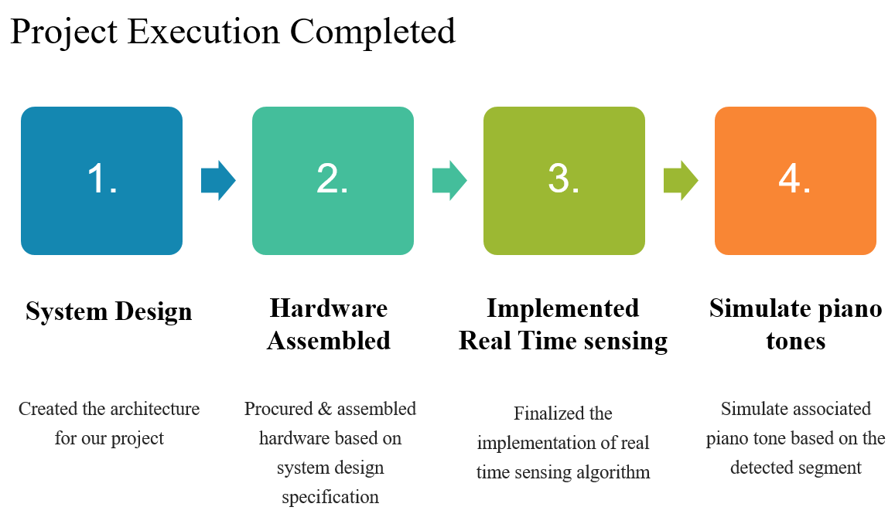
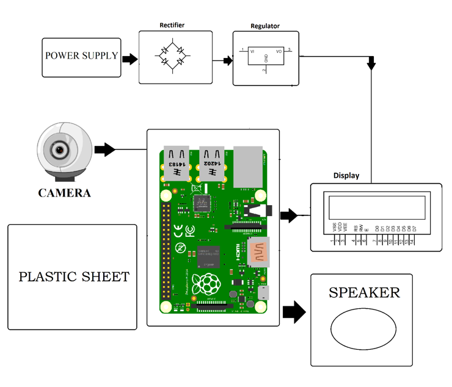

# Virtual Paino

Pianos are large instruments that cannot be carried everywhere. Even electric pianos need to be carried in a large bag and are prone to damage in travelling. So here we propose a portable virtual piano that just uses semi-transparent plastic sheet that can be carried and does not have any electronic components in it. We use a raspberry pi attached to a camera along with the plastic sheet to make a virtual piano. We use image processing to divide the plastic sheet into sections and assign particular tomes to it. We then detect human fingers through the plastic sheet and simulate associate piano tone for each section to play piano tones using a speaker. Thus, we provide a virtual piano which is actually a transparent light weight plastic board that can be carried around roughly.

# Problem Statement

Pianos are large instruments that cannot be carried everywhere. Even electric pianos need to be carried in a large bag and are prone to damage in travelling. So here we propose a portable virtual piano that just uses semi-transparent plastic sheet that can be carried and does not have any electronic components in it.

# Objectives

1. Assigning the respective tones of piano to the corresponding segments of Virtual Piano made using a semi-transparent plastic sheet.
2. Real time motion detection of fingers using a camera linked with Raspberry pi.
3. To play the tone assigned to a segment on detection of finger on that particular segment.

# Project Requirements

1. Hardware Specifications
   Rectifier, Regulator, Power Supply, Speaker, Plastic Sheet, Raspberry Pi, Camera, Partitioned Plastic sheet.
 
2. Software Specifications
        a. Python Compiler
        b. Programming Language: Python

# Project Execution Plan

We propose a method for identifying a piano keyboard present in the video footage of a standard webcam with the goal of teaching chords, scales and suggested finger positions to a beginner pianist. Our keyboard identification method makes use of binary thresholding, Sobel operators and Hough transforms, as well as proposed algorithms specific to this application, to first find an area resembling a piano keyboard before narrowing the search to detect individual keys. Through the use of our method the keys of a piano keyboard were successfully identified from webcam video footage, with a tolerance to camera movement and occluded keys demonstrated. This result allowed the augmented reality style highlighting of individual keys, and the display of suggested fingering, for various chords and scales.

# Assumptions and Constraints

1. Camera should be mounted properly.
2. The camera should be mounted in such a way such that it focusses on each segment properly.
3. The camera should be calibrated before the system starts.
4. The piano should be set up in bright lighting conditions.
5. The size of the piano will depend on the coverage area of camera.
6. The system should fulfil all the basic requirements needed for the project.

# Fabrication

# Project Outcomes

1. Virtual Pianos will reduce the problem of carrying large sized pianos.
2. Large Pianos are prone to damage in travelling and these Virtual Pianos will take care of this issue.
3. Virtual Pianos will be much cheaper than traditional pianos.
4. It will help young children to get a feel for music and will act as a stepping stone for some of the world’s greatest artists.

# Future Plan

1. Code optimization to improve real time sensing.
2. Improved prototype with proper casing to give it a finishing and premium piano look.
3. Investigate using other real time sensing algorithms in OpenCV which might be more robust to varied lighting or other conditions.
